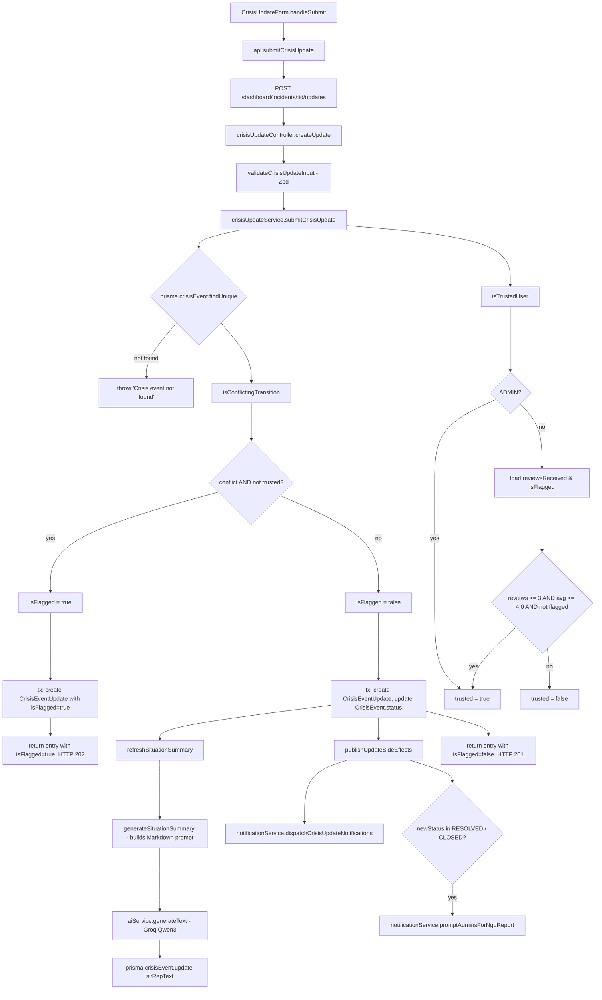
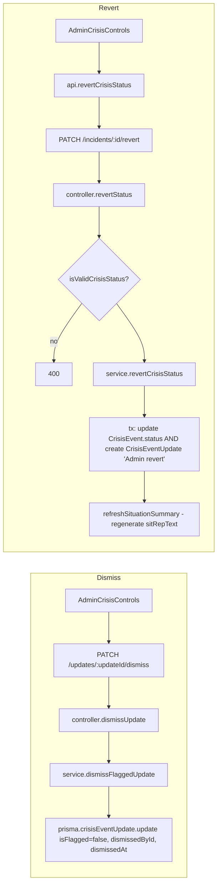
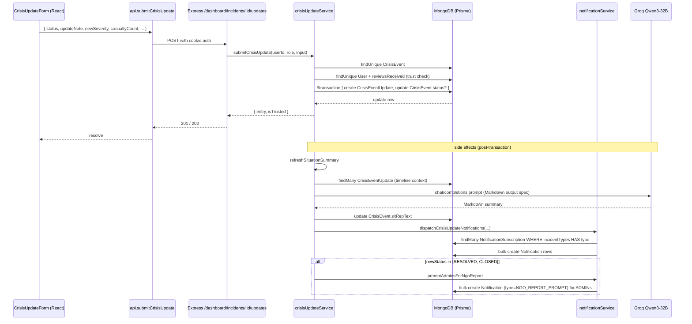

# Feature 3.1 — Live Crisis Updates

**Owner:** Farhan Zarif
**Status:** Complete
**SRS reference:** [SRS §3.1](./SRS.md#module-3--operations-coordination--advanced-features)

---

## 1. Scope

Authorised users (Volunteers, Admins) post append-only status/severity/impact updates to an active crisis event. Every update:

1. Logs an immutable entry in `CrisisEventUpdate`.
2. May be flagged if the status transition skips states (conflict-resolution check).
3. Triggers the Groq Qwen 3-32B LLM to regenerate the live **Situation Update** summary on the crisis.
4. Fans out push notifications to subscribers in range (Feature 3.5).
5. Prompts Admins for NGO Summary Report generation when the crisis moves to `RESOLVED` / `CLOSED`.

---

## 2. Related Files

### Backend
| File | Purpose |
|---|---|
| `backend/src/routes/crisisUpdateRoutes.ts` | Mounts the 4 crisis-update routes under `/api/dashboard/incidents` |
| `backend/src/controllers/crisisUpdateController.ts` | `createUpdate`, `listUpdates`, `dismissUpdate`, `revertStatus` — HTTP adapters |
| `backend/src/services/crisisUpdateService.ts` | Core logic: `submitCrisisUpdate`, `isTrustedUser`, `isConflictingTransition`, `generateSituationSummary`, `refreshSituationSummary`, `publishUpdateSideEffects`, `dismissFlaggedUpdate`, `revertCrisisStatus`, `getCrisisUpdates` |
| `backend/src/services/aiService.ts` | `generateText` wrapper (`reasoning_effort: "none"`, `max_tokens: 800`, 429 retry) |
| `backend/src/services/notificationService.ts` | `dispatchCrisisUpdateNotifications`, `promptAdminsForNgoReport` — called as side effects |
| `backend/src/utils/validation.ts` | `validateCrisisUpdateInput` (Zod) |
| `backend/prisma/schema.prisma` | `CrisisEventUpdate` model + `CrisisEvent.sitRepText` + `CrisisEventStatus` enum |

### Frontend
| File | Purpose |
|---|---|
| `frontend/src/pages/IncidentDetailPage.tsx` | Renders the AI "Situation Update" section via `react-markdown`; hosts the update form + timeline |
| `frontend/src/components/CrisisUpdateForm.tsx` | Form with status/severity/casualty/displacement/damage fields; enforces single-step forward transitions client-side |
| `frontend/src/components/UpdateTimeline.tsx` | Append-only timeline view, flags `isFlagged` entries |
| `frontend/src/components/AdminCrisisControls.tsx` | Admin dismiss + revert panel |
| `frontend/src/services/api.ts` | `submitCrisisUpdate`, `getCrisisUpdates`, `revertCrisisStatus` |
| `frontend/src/types.ts` | `CrisisUpdateInput`, `CrisisUpdateEntry`, `CrisisEventStatus` |

---

## 3. Database Schema

```prisma
model CrisisEventUpdate {
  id              String            @id @default(auto()) @map("_id") @db.ObjectId
  crisisEventId   String            @db.ObjectId
  crisisEvent     CrisisEvent       @relation(...)
  updaterId       String            @db.ObjectId
  updater         User              @relation(...)
  previousStatus  CrisisEventStatus
  newStatus       CrisisEventStatus
  updateNote      String
  newSeverity     IncidentSeverity?
  affectedArea    String?
  casualtyCount   Int?
  displacedCount  Int?
  damageNotes     String?
  isFlagged       Boolean           @default(false)
  dismissedById   String?           @db.ObjectId
  dismissedAt     DateTime?
  createdAt       DateTime          @default(now())

  @@index([crisisEventId, createdAt(sort: Desc)])
}
```

`CrisisEvent.sitRepText: String?` stores the latest AI-regenerated Situation Update Markdown.

---

## 4. API Surface

| Method | Path | Auth | Handler |
|---|---|---|---|
| `POST` | `/api/dashboard/incidents/:id/updates` | any authed user | `createUpdate` |
| `GET`  | `/api/dashboard/incidents/:id/updates` | any authed user | `listUpdates`  |
| `PATCH`| `/api/dashboard/incidents/updates/:updateId/dismiss` | ADMIN | `dismissUpdate`|
| `PATCH`| `/api/dashboard/incidents/:id/revert` | ADMIN | `revertStatus` |

---

## 5. Function Flowchart — Update Submission



### Notes

- **Trust gate constants:** `TRUSTED_VOLUNTEER_THRESHOLD = 4.0`, `MIN_REVIEWS_FOR_TRUST = 3` (crisisUpdateService.ts).
- **Conflict rule:** `toIndex < fromIndex` (backwards) or `toIndex - fromIndex > 1` (skip a state) in `STATUS_ORDER = [REPORTED, VERIFIED, UNDER_INVESTIGATION, RESPONSE_IN_PROGRESS, CONTAINED, RESOLVED, CLOSED]`.
- **Transaction:** Write to `CrisisEventUpdate` and conditional `CrisisEvent.status` update happen in one `prisma.$transaction`. AI regeneration + notifications happen **after** the transaction — they are side effects, not part of the write.
- Flagged updates do **not** mutate `CrisisEvent.status`, do **not** regenerate sitRep, do **not** fan out notifications.

---

## 6. Function Flowchart — Admin Dismiss / Revert



`revertCrisisStatus` intentionally skips notification dispatch — an admin-initiated rewind should not alert subscribers again.

---

## 7. Sequence — Frontend ↔ Backend ↔ DB ↔ AI



---

## 8. AI Integration

**Prompt** (`crisisUpdateService.ts :: generateSituationSummary`) — strict Markdown contract:

- Line 1: bold headline (< 25 words).
- Blank line.
- 2–3 sentence paragraph summarising events so far.
- Blank line.
- 3–5 bullets describing latest developments / risks.
- Length: 120–220 words.

**Groq request defaults** (from `aiService.generateText`):

```
model: env.groqQwenModel          // qwen/qwen3-32b
temperature: 0.7
max_tokens: 800
reasoning_effort: "none"          // suppresses Qwen3 <think> block
```

**Rendering** (`IncidentDetailPage.tsx`):

```tsx
<ReactMarkdown remarkPlugins={[remarkGfm]}>
  {stripThinkingTags(crisisEvent.sitRepText)}
</ReactMarkdown>
```

Scoped `.sitrep-content` styles give `<ul>/<ol>/<li>` custom bullets and `<strong>` color tweaks.

---

## 9. Invariants & Edge Cases

| Invariant | Enforced by |
|---|---|
| `CrisisEventUpdate` is append-only — never deleted or edited | No delete/update route; only `dismissFlaggedUpdate` toggles `isFlagged` |
| Flagged updates never mutate crisis state | `if (!isFlagged)` gate in `submitCrisisUpdate` |
| Trusted volunteers bypass flagging | `isTrustedUser` called before conflict gate |
| Status transitions must be ≤ 1 forward step (client UI) | `CrisisUpdateForm.getAllowedStatuses` |
| Status transitions must be ≤ 1 forward step OR backward (server) | `isConflictingTransition` |
| AI failure must not fail the request | `generateSituationSummary` wraps the AI call in `try/catch`, returns `null`, and `refreshSituationSummary` no-ops |
| Notification fanout failure must not fail the request | `publishUpdateSideEffects` is awaited but happens after the transaction has already committed |
