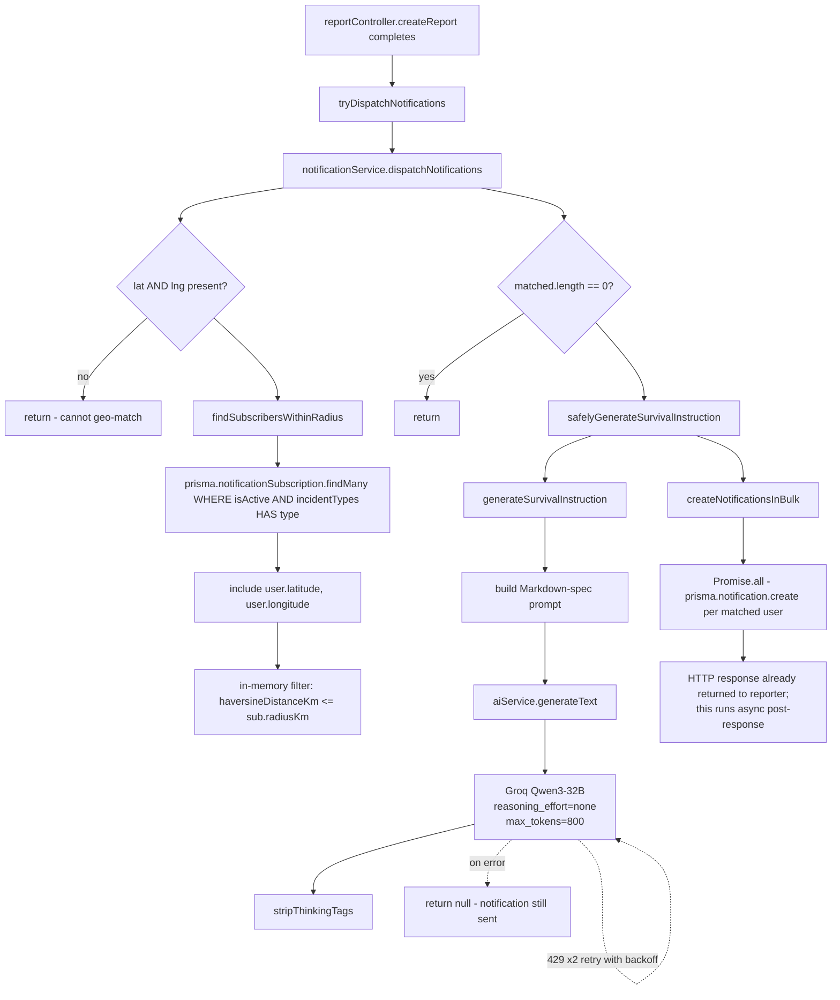
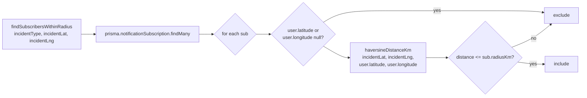
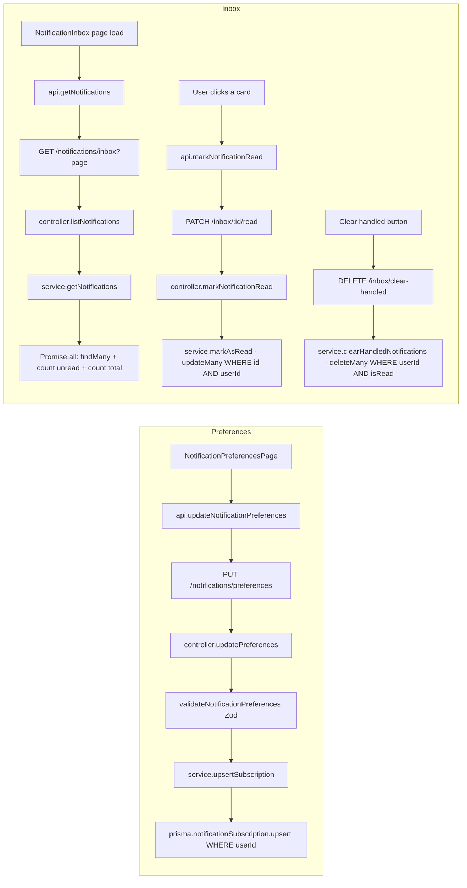
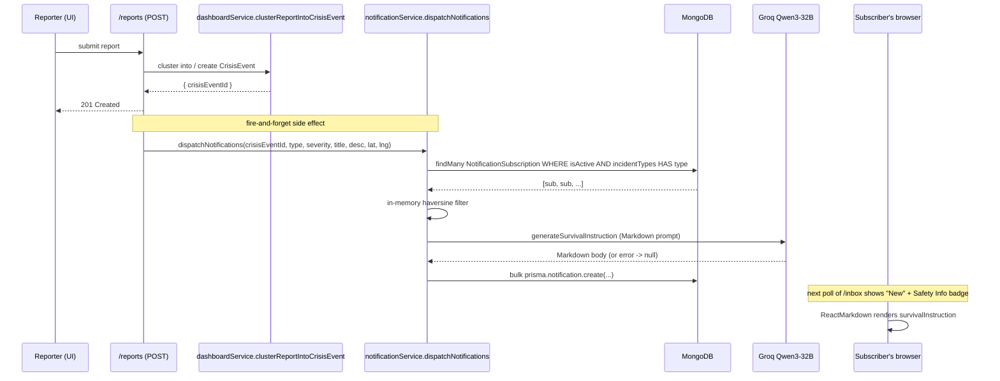

# Feature 3.5 — Targeted Push Notifications

**Owner:** Farhan Zarif
**Status:** Complete
**SRS reference:** [SRS §3.5](./SRS.md#module-3--operations-coordination--advanced-features)

---

## 1. Scope

Users subscribe to crisis categories + a geographic radius and receive AI-generated survival instructions when a matching incident fires. The subsystem also handles non-crisis notification types (crisis updates, NGO report prompts, reservation request/approve/decline) through the same inbox.

**Notification triggers implemented:**

1. **New verified critical/high report** → `dispatchNotifications` (called from `reportController` after clustering).
2. **Crisis update with status change** → `dispatchCrisisUpdateNotifications` (called from `crisisUpdateService.publishUpdateSideEffects`, see Feature 3.1).
3. **Crisis moves to RESOLVED/CLOSED** → `promptAdminsForNgoReport` (ADMIN-only).
4. **Reservation request / approve / decline** → reservation flow calls `createNotificationsInBulk` directly (Feature 3.6).

---

## 2. Related Files

### Backend
| File | Purpose |
|---|---|
| `backend/src/routes/notificationRoutes.ts` | Mounts 7 routes under `/api/notifications` |
| `backend/src/controllers/notificationController.ts` | `updatePreferences`, `getPreferences`, `listNotifications`, `markNotificationRead`, `markAllNotificationsRead`, `triggerDispatch` (admin), `clearHandledNotificationsController` |
| `backend/src/services/notificationService.ts` | Core logic: `upsertSubscription`, `getSubscription`, `findSubscribersWithinRadius`, `createNotificationsInBulk`, `dispatchNotifications`, `dispatchCrisisUpdateNotifications`, `promptAdminsForNgoReport`, `getNotifications`, `markAsRead`, `markAllAsRead`, `generateSurvivalInstruction`, `safelyGenerateSurvivalInstruction`, `clearHandledNotifications` |
| `backend/src/services/aiService.ts` | `generateText` wrapper (`reasoning_effort: "none"` is **load-bearing** here — without it Qwen3's `<think>` block routinely overflowed the 6000 tok/min budget and nuked the survival instruction to `null`) |
| `backend/src/utils/geo.ts` | `haversineDistanceKm` |
| `backend/src/utils/validation.ts` | `validateNotificationPreferences` |
| `backend/prisma/schema.prisma` | `NotificationSubscription`, `Notification`, `NotificationType` enum |
| `backend/src/tests/ai-disable-reasoning.test.ts` | Live-API probe that confirms `reasoning_effort: "none"` suppresses the `<think>` block |
| `backend/src/tests/ai-survival-instruction.test.ts` | Live-API probe for survival instruction output and rate-limit headers |

### Frontend
| File | Purpose |
|---|---|
| `frontend/src/pages/NotificationPreferencesPage.tsx` | Category multi-select, radius slider, master toggle |
| `frontend/src/pages/NotificationInbox.tsx` | Paginated inbox; renders `survivalInstruction` via `react-markdown` + `remark-gfm`; handles reservation approve/decline inline |
| `frontend/src/services/api.ts` | `getNotificationPreferences`, `updateNotificationPreferences`, `getNotifications`, `markNotificationRead`, `clearHandledNotifications` |
| `frontend/src/utils/sanitize.ts` | `stripThinkingTags` (defence in depth — prompts already suppress, but we strip on display) |
| `frontend/src/types.ts` | `NotificationItem`, `NotificationPreferencesInput` |

---

## 3. Database Schema

```prisma
model NotificationSubscription {
  id            String         @id @default(auto()) @map("_id") @db.ObjectId
  userId        String         @db.ObjectId
  user          User           @relation(...)
  incidentTypes IncidentType[]
  radiusKm      Float          @default(10)
  isActive      Boolean        @default(true)
  createdAt     DateTime       @default(now())
  updatedAt     DateTime       @updatedAt

  @@unique([userId])
  @@index([userId, isActive])
}

model Notification {
  id                  String            @id @default(auto()) @map("_id") @db.ObjectId
  userId              String            @db.ObjectId
  user                User              @relation(...)
  crisisEventId       String?           @db.ObjectId
  title               String
  body                String
  survivalInstruction String?           // Markdown, Qwen3-generated
  isRead              Boolean           @default(false)
  createdAt           DateTime          @default(now())
  reservationId       String?           @db.ObjectId
  type                NotificationType?
  statusSnapshot      String?

  @@index([userId, isRead, createdAt(sort: Desc)])
  @@index([userId, createdAt(sort: Desc)])
}

enum NotificationType {
  CRISIS_ALERT
  CRISIS_UPDATE
  NGO_REPORT_PROMPT
  RESERVATION_REQUEST
  RESERVATION_APPROVED
  RESERVATION_DECLINED
}
```

---

## 4. API Surface

| Method | Path | Auth | Handler |
|---|---|---|---|
| `GET`    | `/api/notifications/preferences`        | authed | `getPreferences` |
| `PUT`    | `/api/notifications/preferences`        | authed | `updatePreferences` |
| `GET`    | `/api/notifications/inbox`              | authed | `listNotifications` |
| `PATCH`  | `/api/notifications/inbox/:id/read`     | authed | `markNotificationRead` |
| `POST`   | `/api/notifications/inbox/read-all`     | authed | `markAllNotificationsRead` |
| `DELETE` | `/api/notifications/inbox/clear-handled`| authed | `clearHandledNotificationsController` |
| `POST`   | `/api/notifications/dispatch`           | ADMIN  | `triggerDispatch` |

---

## 5. Function Flowchart — Dispatch on New Crisis Alert



---

## 6. Function Flowchart — Subscriber Match



Matching is **category-first** (indexed `@@index([userId, isActive])` + `incidentTypes HAS type`), then radius-filtered in-memory. For the current subscriber volume this is cheap; for >10k subscribers per category this should move to a geo-index.

---

## 7. Function Flowchart — Preferences & Inbox



`markAsRead` uses `updateMany` (not `update`) so that a malicious `notificationId` belonging to another user silently matches zero rows instead of throwing. Ownership is embedded in the `WHERE` clause (`userId, id`).

---

## 8. Sequence — End-to-End on New CRITICAL Report



---

## 9. AI Integration

**Prompt** (`notificationService.ts :: generateSurvivalInstruction`) — strict Markdown contract:

- Line 1: bold imperative directive (< 20 words).
- Blank line.
- 4–6 bullets, each an imperative sentence < 25 words.
- Length: 80–150 words.

**Groq request defaults** (from `aiService.generateText`):

```
model: env.groqQwenModel          // qwen/qwen3-32b
temperature: 0.7
max_tokens: 800                   // protects the 6000 tok/min ceiling
reasoning_effort: "none"          // Qwen3-specific: suppress <think> block
```

Without `reasoning_effort: "none"`, Qwen3 emits a 2000+ char `<think>` block before the answer, regularly pushing past the per-call output budget and hitting the 6000 tok/min rate cap when multiple notifications fire in the same minute (e.g. crisis update + reservation). This was the root cause of the earlier "Safety Info is null" bug.

**Rendering** (`NotificationInbox.tsx`):

```tsx
<ReactMarkdown remarkPlugins={[remarkGfm]}>
  {stripThinkingTags(n.survivalInstruction!)}
</ReactMarkdown>
```

Same scoped CSS approach as Feature 3.1 — bullets get accent dots, headings get ink color, paragraphs get spacing.

---

## 10. Multi-Source Dispatch Cheat Sheet

| Trigger | Entry point | Service call | `type` stored |
|---|---|---|---|
| New CRITICAL/HIGH report clusters to new event | `reportController.createReport` | `dispatchNotifications` | `CRISIS_ALERT` |
| Crisis status change | `crisisUpdateService.publishUpdateSideEffects` | `dispatchCrisisUpdateNotifications` | `CRISIS_UPDATE` |
| Crisis moves to RESOLVED/CLOSED | same as above | `promptAdminsForNgoReport` | `NGO_REPORT_PROMPT` |
| Reservation created | `resourceService` (Feature 3.6) | `createNotificationsInBulk` | `RESERVATION_REQUEST` |
| Reservation approved/declined | `resourceService` (Feature 3.6) | `createNotificationsInBulk` | `RESERVATION_APPROVED` / `RESERVATION_DECLINED` |

All flow through the same `Notification` table, the same inbox UI, and the same pagination.

---

## 11. Invariants & Edge Cases

| Invariant | Enforced by |
|---|---|
| Subscribers with no geolocation are skipped | `findSubscribersWithinRadius` returns `false` when lat/lng null |
| Notification body is truncated at 200 chars | `createNotificationsInBulk` slices description |
| AI failure never blocks the notification | `safelyGenerateSurvivalInstruction` wraps in try/catch, returns `null`, notification still created |
| Rate-limit 429 from Groq retries twice with backoff | `aiService.callGroq` — `MAX_429_RETRIES = 2`, backoff = `max(retryAfter*1000, 2000*(attempt+1))` |
| Users can only read / mark their own notifications | `updateMany WHERE { userId, id }` in `markAsRead` |
| Inbox is paginated 20/page max | Clamp in `controller.listNotifications` (`Math.min(20, ...)`) |
| Preferences are user-unique | `@@unique([userId])` on `NotificationSubscription` + `prisma.upsert` keyed by `userId` |
| `clearHandledNotifications` deletes only READ notifications | `deleteMany WHERE { userId, isRead: true }` — unread work is never destroyed |
| Survival instructions are AI-generated markdown, not HTML | React renders via `react-markdown` — no `dangerouslySetInnerHTML`; no XSS surface |
